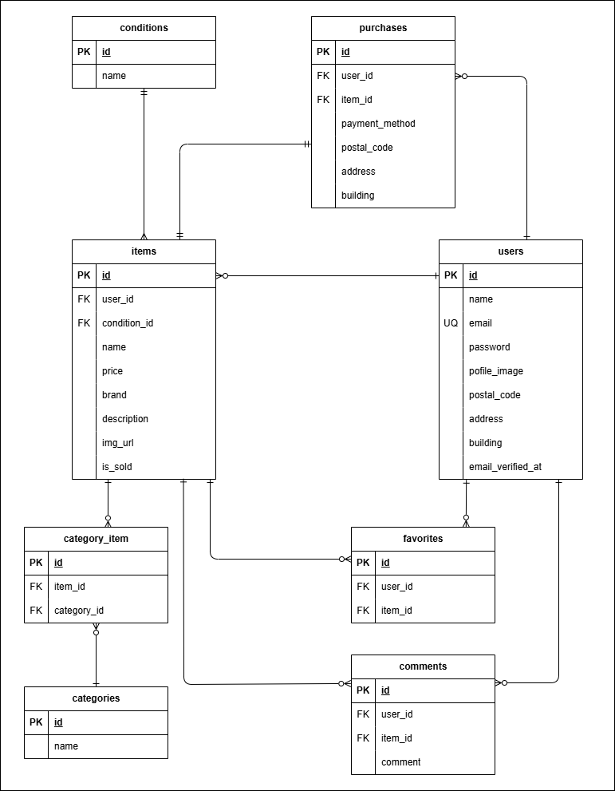

# flea-market-app (coachtech フリマアプリ)

## 環境構築


**Dockerビルド手順**

1. リポジトリをクローン
``` bash
git clone git@github.com:Oda-mi/flea-market-app.git
```
2. Docker Desktop を起動
3. コンテナをビルドして起動
``` bash
docker-compose up -d --build
```


**Laravel環境構築手順**

1. PHPコンテナに入る
``` bash
docker-compose exec php bash
```
2. 依存関係をインストール
``` bash
composer install
```
3. .env.example をコピーして .env ファイルを作成
``` bash
cp .env.example .env
```
4. .env に以下の環境変数を追加
```text
DB_CONNECTION=mysql
DB_HOST=mysql
DB_PORT=3306
DB_DATABASE=laravel_db
DB_USERNAME=laravel_user
DB_PASSWORD=laravel_pass
```
5. アプリケーションキーを生成
``` bash
php artisan key:generate
```
6. マイグレーションを実行
```bash
php artisan migrate
```
7. シーディングを実行
```bash
php artisan db:seed
```

## ダミーユーザー情報（シーディング用）

- 名前: テスト太郎
- メール: test@email.com
- パスワード: 12345678

※シーダー実行で自動的に作成されます


## 開発用 Laravel サーバー自動起動について
- Docker コンテナ起動時に php コンテナで自動的に Laravel 開発サーバー（php artisan serve）が立ち上がります
- 手動で `php artisan serve` を実行する必要はありません
- ブラウザで以下の URL にアクセスしてください
  - http://localhost:8000


## メール認証機能について
MailHog を使用して開発環境でメール認証を確認します

### MailHog のセットアップ
1. MailHog をダウンロード・インストール
   - [GitHubのリリースページ](https://github.com/mailhog/MailHog/releases/v1.0.0) から使用しているOSに適したバージョンをダウンロードしてください
2. Docker を使用時は `docker-compose.yml` に定義済みです
3. `.env` に以下の環境変数を追加
```env
MAIL_MAILER=smtp
MAIL_HOST=mailhog
MAIL_PORT=1025
MAIL_USERNAME=null
MAIL_PASSWORD=null
MAIL_ENCRYPTION=null
MAIL_FROM_ADDRESS=test@email.com
MAIL_FROM_NAME="${APP_NAME}"
```
4. MailHog を起動後、以下で送信メールを確認可能
   - http://localhost:8025


## Stripe決済機能について
Stripe のテストモードを使用して開発環境で決済機能を確認します

### Stripe テスト用セットアップ

1. Stripe PHP ライブラリをインストール
```bash
composer require stripe/stripe-php:^13.0
```

2. Stripe アカウントを作成し、テスト用 API キーを取得
   - [Stripe公式サイト](https://dashboard.stripe.com/test/apikeys)にログインし、テストキーを確認します

3. .env に以下の環境変数を追加
```text
STRIPE_SECRET=sk_test_************************
STRIPE_KEY=pk_test_************************
STRIPE_WEBHOOK_SECRET=whsec_************************
```

4. Stripe CLI をインストール  
  Stripe CLI は、テスト環境で Webhook を受信・確認するために使用します
   -  [Stripe CLI インストールガイド（公式）](https://stripe.com/docs/stripe-cli)を参考に、環境に合わせてインストールしてください
5. Stripe にログイン
```bash
stripe login
```
6. Webhook をローカルに転送（実行中のターミナルは開いたままにしてください）
```bash
stripe listen --forward-to http://localhost:8000/api/stripe/webhook
```
※実行後に表示される `whsec_********` を `.env` の `STRIPE_WEBHOOK_SECRET` に設定してください


### テスト用カード情報
- カード番号: 4242 4242 4242 4242
- 有効期限: 任意（例 12/34）
- CVC: 任意（例 123）


## テスト機能について

本アプリでは Laravel 標準の PHPUnit を使用してテストを実行します　　


※テストケース「支払い方法選択機能」は JavaScript により実装されており、　　
PHPUnit ではテスト実行ができないためテストコードは未作成としています　　


テスト実行時には Factory および Seeder により必要なダミーデータが自動的に生成されます


### 1. テスト環境設定

1. `.env.testing` ファイルを作成
```bash
cp .env .env.testing
```

2. `.env.testing` に以下の環境変数を設定
```text
DB_CONNECTION=mysql
DB_HOST=mysql
DB_PORT=3306
DB_DATABASE=demo_test
DB_USERNAME=root
DB_PASSWORD=root
```

3. アプリケーションキーを生成
```bash
php artisan key:generate --env=testing
```
4. キャッシュをクリア
```bash
php artisan config:clear
```


### 2. テスト実行手順
1. PHPコンテナに入る
```bash
docker-compose exec php bash
```
2. マイグレーションとシーディングを実行
```bash
php artisan migrate --env=testing
```
3. キャッシュをクリア
```bash
php artisan optimize:clear
```
4. テストを実行
```bash
php artisan test tests/Feature/FleaMarketAppTest.php
```


### 3. テスト用ダミーデータについて
- ユーザー情報、商品情報、カテゴリー情報などはFactory と Seeder によって自動生成されます
- テスト実行のたびにデータベースが初期化・再生成されます


## 使用技術（実行環境）
- Laravel : 8.83.8
- PHP : 8.4.10
- MySQL : 8.0


## ER図



## URL (開発環境)
- トップページ商品一覧: http://localhost:8000/
- ユーザー登録: http://localhost:8000/register
- ログイン: http://localhost:8000/login
- phpMyAdmin: http://localhost:8080


